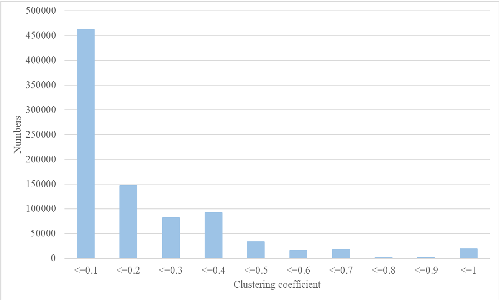
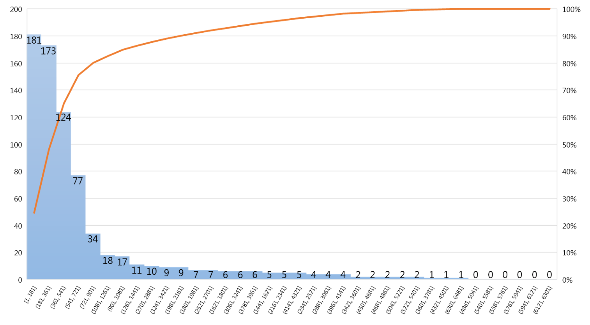

# Web graph analysis

This project is assignment 1 of course `Social Network and Computing` in National Chung Hsing University, department of computer science and engineering. The aims of this project are to calculate the average degree, average clustering coefficient, diameter and degree distribution.

## Getting Started

Dataset introduction

* 2002 website dataset
* Node : Website
* Edge : hyperlink
* Node numbers : 875,713
* Edges number: 5,105,039

More detailed information about the dataset and the file can be find in [this website](https://snap.stanford.edu/data/web-Google.html).

### Prerequisites

What things you need to install the software and how to install them

```
1.C++ compiler
2.Python
```

## Run the code

The source codes are under the `/src` folder. Here is an example to run the code.

* C++ code

```
$clang++ /src/dijkstra_v2.cpp -O3 -o dijstra.out
```

* Python code

```
$python sorting.py
```

End with an example of getting some data out of the system

## Results of this project

* Average degree: 9
* Directed diameter: 22
* Undirected diameter: 24
* Average clustering coefficient: 0.160976
* Average clustering coefficient (Without the node degree = 1): 0.195165
* Clustering Coefficient distribution image



* Degree distribution image



## Authors

* **Tai-Lin, Chiu** -- [github](https://github.com/niLiaT)
* **Chun-Hung, Fan**

## License

This project is licensed under the MIT License
